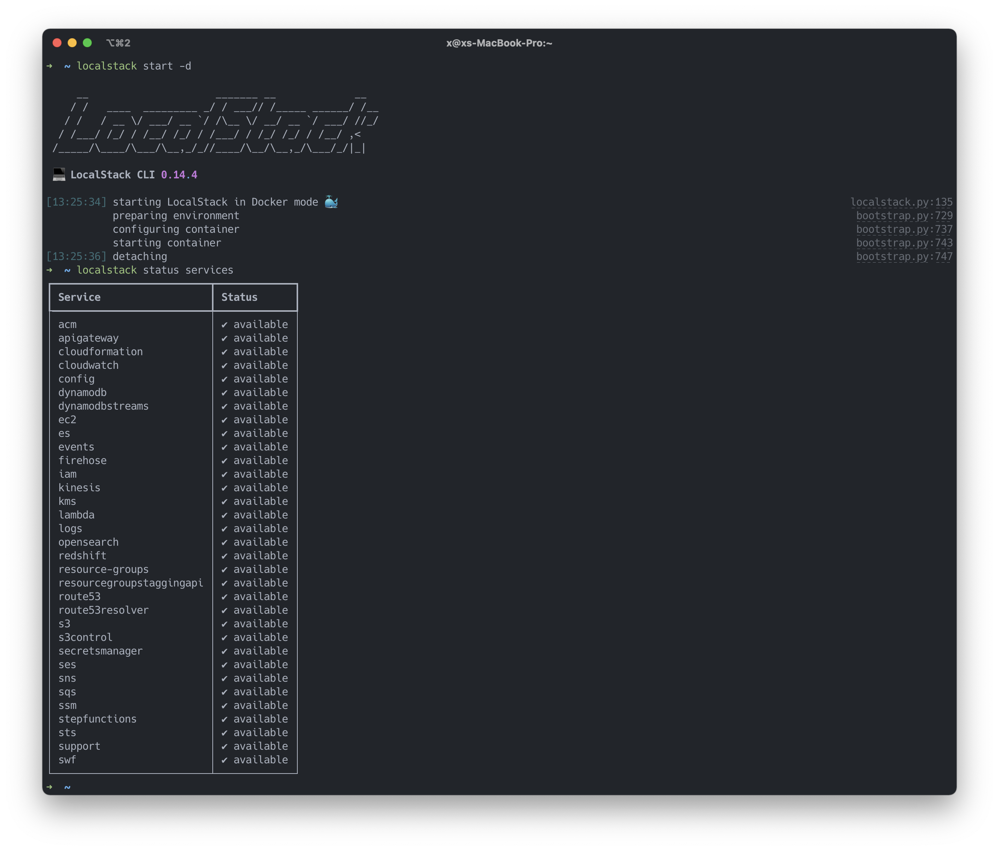

# Local Development with AWS using LocalStack 

* [LocalStack](#localstack)
  * [Install and launch](#install-and-launch)
    * [Python3 and Docker](#python3-and-docker)
    * [Docker Compose](#docker-compose)
  * [Configure AWS CLI profile](#configure-aws-cli-profile)
    * [Create S3 Buckets](#create-s3-buckets)
  * [Connecting to LocalStack](#connecting-to-localstack)

LocalStack is an open-source mock of the real AWS services. It provides a testing 
environment on your local machine with the same APIs as the real AWS services. 

LocalStack is a Python application designed to run as an HTTP request processor while listening on specific ports. 

## Install and Launch

### Python3 and Docker
See the official [LocalStack GitHub repository](https://github.com/localstack/localstack) for requirements _(python, pip, and docker versions)_.

Start LocalStack inside a Docker container using the LocalStack CLI:
```shell
# Start 
localstack start -d

# LocalStack is running on 
http://localhost:4566

# See status of AWS services
localstack service status
```


### Docker Compose
The base `docker-compose.yml` file from the [LocalStack](https://github.com/localstack/localstack/blob/master/docker-compose.yml) repository is used. 

The default behavior of LocalStack is to spin up all the supported AWS services
with each of them listening on port 4566. You can override this behavior by 
setting a few environment variables. 

You can configure LocalStack to spin up a limited set of services by using a 
comma-separated list of AWS service names as value for the environment variable 
`services`:
```yaml
environment:
    - SERVICES: s3, lambda, dynamodb
```
In the example above, the environment variable `SERVICES` is set to the name 
of the AWS services we want to use in the application (s3, lambda, and dynamodb).

Start LocalStack 
```shell
docker-compose up
```

### Configure AWS CLI profile
Configure a fake AWS CLI profile to be able to invoke the services provided by LocalStack. 
```shell
# Create a profile called localstack (profile name can be anything)
aws configure --profile localstack
```
This will prompt for the AWS Access Key, Secret Key, and an AWS region. Provide any 
dummy value for the credentials and a valid region name like `eu-west-1`, but the none
of the values can be left blank. 

Unlike AWS, LocalStack doens't validate these credentials but complains if not profile is set. The profile is stored in `~/.aws/config`:
```shell
[profile localstack]
region = eu-west-1
output = json
```

Set the default profile 
```shell
export AWS_DEFAULT_PROFILE=localstack

# check profiles
aws configure list 
```

#### Create S3 Buckets
The `--endpoint-url` must be specified when using the AWS CLI to communicate with services running on LocalStack
```shell
# Create bucket
aws --endpoint-url=http://0.0.0.0:4566 s3 mb s3://<bucket-name>

# List buckets
aws --endpoint-url=http://0.0.0.0:4566 s3api list-buckets --query "Buckets[].Name"

# Output  
[
  "mytestbucket",
  "someOtherBucket"
]
```

TODO: Use make to interact with AWS CLI and LocalStack.
TODO: implement the following functionality in a `Makefile`
```shell
# todo s3 create, upload, delete, get, etc. 
make create-bucket <name>
make upload-object <file>

# todo secret create, delete, update, etc.
make create-secret <name>

etc.
```

### Connecting to LocalStack
Todo...

### Troublshooting

Error creating S3 bucket: RequestError: send request failed
```shell
╷
│ Error: Error creating S3 bucket: RequestError: send request failed
│ caused by: Put "http://bucket.0.0.0.0:4566/": dial tcp: lookup bucket.0.0.0.0 on 193.162.153.164:53: no such host
│ 
│   with aws_s3_bucket.sample_bucket,
│   on main.tf line 5, in resource "aws_s3_bucket" "sample_bucket":
│    5: resource "aws_s3_bucket" "sample_bucket" {
│ 
```
Solution: 
```terraform
// Set "s3_force_path_style = true" in the provider
provider "aws" {
  s3_force_path_style         = true
}
```


### Source 

* [AWS Profiles](https://stackoverflow.com/questions/31012460/how-do-i-set-the-name-of-the-default-profile-in-aws-cli)
